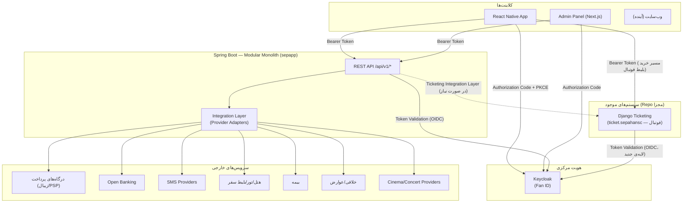
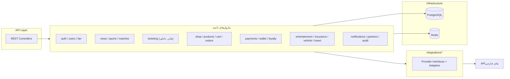

# SEPahan Super App — Architecture Overview

> **Status:** Proposed — منتظر تأیید کارفرما (Phase 1)
> **آخرین به‌روزرسانی:** 2026-08-15

این سند دید کلی معماری هدف را ترسیم می‌کند. تصمیم‌های جزئی‌تر در فایل‌های `docs/adr/*` مستند شده‌اند؛ این فایل فقط چهارچوب کلی و نحوه‌ی کنار هم قرار گرفتن اجزا را نشان می‌دهد.

## 1. اصل موضوع

SEPahan Super App روی دو دسته سیستم بنا می‌شود:

1. **سیستم‌های موجود (Legacy، حفظ می‌شوند، بازنویسی نمی‌شوند):**
   - `ticket.sepahansc` — سامانه‌ی Django فروش بلیط فوتبال، در Production زنده و پول‌ساز.
   - `sepahan-shop` — صرفاً به‌عنوان مرجع UI/UX نگه داشته می‌شود؛ بک‌اند آن استفاده نمی‌شود (طبق تصمیم کارفرما — [ADR-0002](../adr/0002-modular-monolith-and-module-boundaries.md)).
2. **سیستم‌های جدید (در Monorepo `sepapp` ساخته می‌شوند):**
   - Backend اصلی: Spring Boot، Modular Monolith
   - Admin Panel: Next.js + TypeScript
   - Mobile App: React Native + TypeScript
   - Identity Provider: Keycloak (Fan ID)
   - Integration Layer: آداپتورهای سرویس‌های خارجی

اتصال بین این دو دسته **فقط از طریق SSO/API** انجام می‌شود، نه ادغام کد یا دیتابیس مشترک.

## 2. نمودار Context سیستم



## 3. لایه‌بندی داخلی Backend (Modular Monolith)



جزئیات مرزبندی هر ماژول در [ADR-0002](../adr/0002-modular-monolith-and-module-boundaries.md) آمده است.

## 4. اصول راهنما (از prompt.md)

این اصول در تمام تصمیم‌های معماری رعایت می‌شوند:

- اولویت: Security > Correctness > Maintainability > Scalability > Observability > Performance > DX > Speed
- Modular Monolith در فاز اول؛ عدم ایجاد Microservice غیرضروری
- هیچ Business Logic ای مستقیم به API شرکت خارجی وابسته نیست — همه از طریق Provider Interface
- سیستم Django فعلی دست‌نخورده می‌ماند؛ فقط از طریق SSO/API به آن وصل می‌شویم
- هیچ اطلاعات حساسی در Git/کد/Dockerfile/Log قرار نمی‌گیرد

## 5. Monorepo — چیدمان سطح بالا (اسکلت ایجادشده در Phase 2)

```
sepapp/
├── backend/            # Spring Boot Modular Monolith
├── admin-panel/        # Next.js + TypeScript
├── mobile/             # React Native + TypeScript
├── integration/        # مشترک بین backend و مستندسازی Providerها (اگر لازم شود)
├── infra/              # Docker Compose, Keycloak realm export, ...
└── docs/
    ├── architecture/
    ├── adr/
    ├── api/
    ├── authentication/
    ├── integrations/
    ├── deployment/
    └── database/
```

ساختار دقیق پوشه‌ها (پکیج‌بندی داخلی Spring Boot، ساختار Next.js/React Native) موضوع **Phase 2 — Repository Structure** است و در این فاز قطعی نمی‌شود.

## 6. فهرست ADRهای این فاز

| ADR | موضوع |
|---|---|
| [0001](../adr/0001-monorepo-strategy.md) | استراتژی Monorepo برای اجزای جدید |
| [0002](../adr/0002-modular-monolith-and-module-boundaries.md) | Modular Monolith و مرزبندی ماژول‌ها |
| [0003](../adr/0003-keycloak-central-sso-fan-id.md) | Keycloak به‌عنوان SSO مرکزی / Fan ID |
| [0004](../adr/0004-django-ticketing-sso-integration.md) | الگوی اتصال SSO به Django Ticketing |
| [0005](../adr/0005-integration-provider-pattern.md) | الگوی Integration Provider |
| [0006](../adr/0006-inhouse-theater-ticketing.md) | موتور داخلی فروش بلیط تئاتر |
| [0007](../adr/0007-database-strategy.md) | استراتژی دیتابیس |
| [0008](../adr/0008-new-user-jit-provisioning.md) | Provisioning خودکار کاربر جدید Fan ID در Django (Phase 5) |
| [0009](../adr/0009-spring-boot-baseline.md) | Spring Boot 3.5.x + Maven + Flyway (Phase 6) |
| [0010](../adr/0010-ticketing-redis-locking.md) | قفل هم‌زمانی رزرو صندلی با Redis (Phase 8) |
| [0011](../adr/0011-payment-architecture.md) | معماری Payment: Zibal + Event-driven decoupling (Phase 9) |
| [0012](../adr/0012-shop-module.md) | ماژول Shop: Inventory اتمی، Provider Interface برای Shipping، گردش‌کار Returns (Phase 10) |
| [0013](../adr/0013-news-cms.md) | ماژول News/CMS: Media روی دیسک محلی، Revision کامل، انتشار زمان‌بندی‌شده (Phase 11) |
| [0014](../adr/0014-loyalty-module.md) | ماژول Loyalty: سطح/امتیاز/جایزه‌ی Configurable، اتصال بلیط فوتبال با Polling از Django (Phase 12) |
| [0015](../adr/0015-notifications-and-partners.md) | Notifications (SMS.ir/SMTP/Push-Fake) و اسکلت Partners؛ Banking/Vehicle/Insurance/Travel/Entertainment کنار گذاشته شدند (Phase 13) |
| [0016](../adr/0016-admin-panel.md) | Admin Panel: Next.js 16 + Auth.js/Keycloak (BFF) + Ant Design؛ فقط بخش‌های دارای Backend واقعی (Phase 14) |
| [0017](../adr/0017-mobile-app.md) | اپ موبایل: Expo + expo-auth-session/Keycloak (PKCE، Client عمومی)؛ Wallet/Services/Matches «به‌زودی» صادقانه؛ رفع باگ واقعی Race در JIT Provisioning (Phase 15) |
| [0018](../adr/0018-real-push-notifications.md) | Push واقعی با FCM مستقیم (firebase-admin)؛ رفع نقص Token مرده‌ی تکرارشونده؛ رفع نقص عمیق‌تر Self-Invocation در JIT Provisioning (users/loyalty، از Phase 5)؛ محدودیت پذیرفته‌شده‌ی بدون تست زنده (Phase 16) |
| [0019](../adr/0019-observability.md) | Observability: Prometheus + Grafana + Loki خودمیزبان، Correlation ID سبک (بدون OpenTelemetry)، Metricهای سفارشی JIT Race/Notifications (Phase 17) |

## 7. خارج از محدوده‌ی Phase 1

موارد زیر **عمداً** در این فاز تصمیم‌گیری نشده‌اند و در فازهای مربوطه بررسی می‌شوند:

- ساختار دقیق پکیج‌های Java و فولدرهای Next.js/React Native → Phase 2
- انتخاب ابزار Migration (Flyway/Liquibase) و نصب واقعی آن → Phase 6 (نیازمند تأیید Dependency طبق قانون ۲۶)
- ERD کامل و ایندکس‌گذاری → Phase 5/6
- طراحی صفحه‌به‌صفحه‌ی UI/UX → فازهای مربوط به Admin Panel (14) و Mobile (15)؛ در همین فاز فقط **پایه‌ی Design System** (رنگ، تایپوگرافی، کامپوننت‌های پایه) ارائه می‌شود تا مبنای طراحی فازهای بعد باشد.
