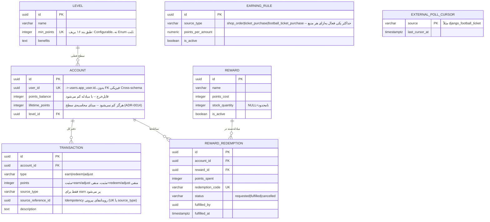

# ERD — `loyalty`

مرجع تصمیم: [ADR-0014](../adr/0014-loyalty-module.md). قراردادهای پایه: [conventions.md](conventions.md).

## دیاگرام

## تصمیم‌های طراحی

### چرا `lifetime_points` جدا از `points_balance` است

طبق ADR-0014: سطح عضویت روی `lifetime_points` (هرگز کم نمی‌شود) محاسبه می‌شود، نه `points_balance` (با خرج‌کردن کم می‌شود) -- تا خرج‌کردن امتیاز باعث افت غیرمنصفانه‌ی سطح نشود.

### چرا `TRANSACTION` یک دفترکل Append-only است، نه فقط دو ستون روی `ACCOUNT`

طبق بند ۱۶ بریف («Transactions» صریحاً فهرست شده) -- تاریخچه‌ی کامل کسب/خرج/اصلاح امتیاز باید قابل مرور باشد، مشابه انضباط `ArticleRevision`/`OrderItem` در فازهای قبل.

### چرا `source_reference_id` روی `TRANSACTION` است، نه یک جدول Idempotency جدا

هم‌الگوی `payments.payment` (ADR-0011): یک Partial Unique Index روی `(source_type, source_reference_id)` مستقیماً جلوی کسب امتیاز تکراری برای یک رویداد را می‌گیرد -- بدون نیاز به جدول/سرویس جدا فقط برای همین منظور.

### فیلدهای عمداً حذف‌شده در این فاز

- هیچ انقضای زمانی برای امتیاز -- در بند ۱۶ بریف ذکر نشده.
- هیچ تحویل خودکار جایزه (پستی/دیجیتال) -- `REWARD_REDEMPTION` فقط یک کد صادر می‌کند؛ تحویل کاملاً دستی توسط ادمین است (ADR-0014).
