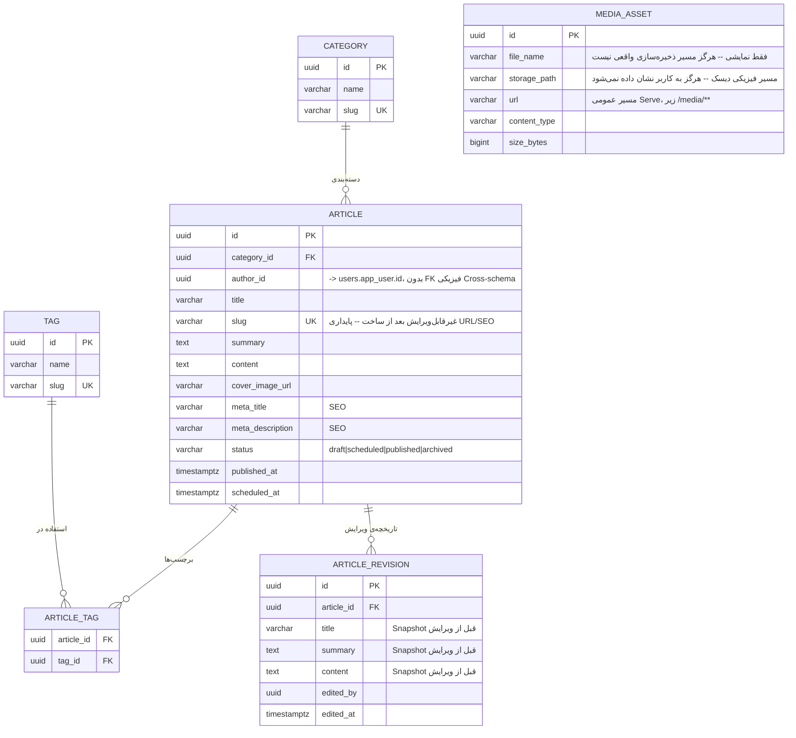

# ERD — `news` (News / CMS)

مرجع تصمیم: [ADR-0013](../adr/0013-news-cms.md). قراردادهای پایه: [conventions.md](conventions.md).

## دیاگرام

## تصمیم‌های طراحی

### چرا `slug` بعد از ساخت غیرقابل‌ویرایش است

پایداری URL/SEO -- تغییر بعدی لینک‌های موجود (از جمله لینک‌های Share شده در شبکه‌ی اجتماعی) را می‌شکند. جزئیات در [ADR-0013](../adr/0013-news-cms.md).

### چرا `ARTICLE_REVISION` جدول جدا و Append-only است

طبق بند ۱۷ بریف («Revision»)، هر ویرایش باید قابل بازیابی باشد. حالت *قبلی* (نه جدید) در این جدول Snapshot می‌شود، پیش از اعمال تغییر روی خود `ARTICLE` -- مشابه انضباط `OrderItem`/`Payment.amount` در فازهای قبل (هیچ داده‌ی تاریخی با تغییر بعدی رکورد اصلی عوض نمی‌شود).

### چرا `MEDIA_ASSET` هیچ FK ای به `ARTICLE` ندارد

یک تصویر می‌تواند قبل از اتصال به هیچ خبری آپلود شود (مثلاً از یک کتابخانه‌ی رسانه‌ی مشترک در آینده)، یا در چند خبر/جای مختلف استفاده شود. `cover_image_url` روی `ARTICLE` فقط یک رشته‌ی URL است، نه یک رابطه‌ی رابطه‌ای سخت.

### فیلدهای عمداً حذف‌شده در این فاز

- هیچ اتصال واقعی به یک سرویس Object Storage (S3/MinIO) -- دیسک محلی، تصمیم صریح کارفرما (ADR-0013).
- هیچ سیستم Comment/نظر روی خبر -- در بریف ذکر نشده.
- کتابخانه‌ی رسانه‌ی قابل‌مرور/جست‌وجو (Media Library UI) -- موضوع Admin Panel، Phase 14.
