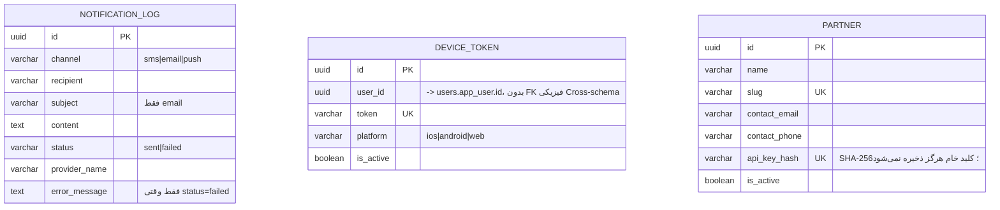

# ERD — `notifications` و `partners`

مرجع تصمیم: [ADR-0015](../adr/0015-notifications-and-partners.md). قراردادهای پایه: [conventions.md](conventions.md).

## دیاگرام

## تصمیم‌های طراحی

### چرا `NOTIFICATION_LOG` هر تلاش (موفق و ناموفق) را ثبت می‌کند

طبق بند ۸ بریف («Logging» جزء الزامات هر Integration است) و برای Audit/عیب‌یابی -- بدون این دفترکل، شکست بی‌صدای یک Provider (طبق طراحی Best-effort در ADR-0015) هرگز قابل کشف نبود.

### چرا `api_key_hash` روی `PARTNER` است، نه یک جدول Credential جدا

با یک Partner واحد، یک ستون کافی است -- یک جدول جدا فقط برای یک راز، پیچیدگی بی‌دلیل اضافه می‌کرد (طبق اصل «بدون Abstraction زودهنگام»).

### فیلدهای عمداً حذف‌شده در این فاز

- هیچ ستون/جدول برای Banking/Vehicle/Insurance/Travel/Entertainment -- طبق تصمیم صریح کارفرما (ADR-0015)، حتی طراحی Schema برای این‌ها بدون یک API واقعی نوعی حدس‌زدن بود.
- هیچ Endpoint/جدول Webhook برای Partner واقعی -- طراحی دقیق داده/API هر Partner وقتی یک Partner واقعی امضا شود، موضوع فاز خودش خواهد بود.
