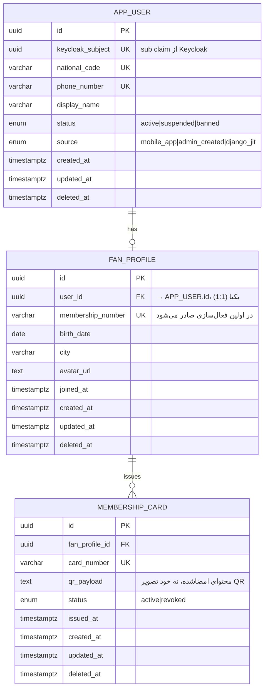

# ERD — `users` و `fan`

قراردادهای پایه (ستون‌های مشترک، Soft Delete): [conventions.md](conventions.md). استراتژی کلی دیتابیس: [ADR-0007](../adr/0007-database-strategy.md). این سند خروجی Phase 5 است و مدل داده‌ی دو ماژول اول را (که پیش‌نیاز تقریباً همه‌ی ماژول‌های دیگر هستند) مشخص می‌کند.

## دیاگرام

## چرا `users` و `fan` دو Schema/جدول جدا هستند، نه یکی

- **`users.app_user`** هویت فنی/امنیتی است: نگاشت به Keycloak Subject، وضعیت حساب، شناسه‌های یکتا (کد ملی/تلفن). این جدول توسط تقریباً همه‌ی ماژول‌های دیگر به‌عنوان کلید خارجی مصرف می‌شود (`wallet.wallet.user_id`, `orders.order.user_id`, ...).
- **`fan.fan_profile`** داده‌ی محصولی/تجربه‌ی هوادار است (طبق بند ۹ بریف، `fan` ماژول جداست از `users`): کارت عضویت، شهر، تاریخ تولد، آواتار. این‌ها می‌توانند بدون لمس جدول امنیتی `app_user` تغییر کنند (مثلاً افزودن یک فیلد نمایشی جدید به پروفایل هوادار نباید ریسکی به هسته‌ی احراز هویت اضافه کند).
- رابطه‌ی ۱:۱ عمدی است، نه ادغام در یک جدول — جدا نگه‌داشتن Concern امنیتی از Concern محصولی، طبق اولویت اول بریف (Security).

## نکات کلیدی فیلدها

- **`keycloak_subject`**: منبع حقیقت هویت. هر عملیات احراز هویت‌شده در نهایت این مقدار را از JWT (`sub` claim) می‌خواند.
- **`national_code`/`phone_number`**: هم در Keycloak (به‌عنوان User Attribute، طبق [docs/authentication/keycloak-realm.md](../authentication/keycloak-realm.md)) و هم این‌جا نگهداری می‌شوند — تکرار عمدی است تا این جدول بتواند مستقل کوئری بگیرد (بدون فراخوانی همیشگی Keycloak Admin API)، و همین دو فیلد پل نگاشت به `User` موجود در Django هستند ([ADR-0004](../adr/0004-django-ticketing-sso-integration.md), [ADR-0008](../adr/0008-new-user-jit-provisioning.md)).
- **`source`**: برای ردیابی این‌که رکورد از کجا آمده (ثبت‌نام مستقیم موبایل، ساخته‌شده توسط ادمین، یا JIT از مسیر Django) — صرفاً برای Observability/Debug، نه منطق تجاری.
- **`membership_number`**: در لحظه‌ی ساخت `app_user` صادر نمی‌شود؛ در اولین فعال‌سازی واقعی پروفایل صادر می‌شود (جزئیات دقیق در Phase 6).
- **`qr_payload`**: مطابق الگوی امن سیستم بلیط فوتبال (که در Phase 0 کشف شد: فایل بلیط دیگر مستقیم Serve نمی‌شود)، این‌جا هم فقط محتوای امضاشده ذخیره می‌شود، نه تصویر — تولید تصویر QR در لحظه‌ی نمایش انجام می‌شود.

## این سند چه چیزی را تصمیم نمی‌گیرد

- ایندکس‌گذاری دقیق (غیر از Unique Constraintهای بدیهی روی `national_code`/`phone_number`/`keycloak_subject`/`card_number`) — بسته به الگوی واقعی Query در Phase 6 تنظیم می‌شود.
- جدول‌های `wallet`, `loyalty`, `orders` و غیره — این‌ها در فازهای خودشان (۹، ۱۰، ۱۲) طراحی می‌شوند؛ فقط قرارداد کلی «هر ماژول با `user_id` به `users.app_user.id` ارجاع می‌دهد» همین‌جا تثبیت شد.
